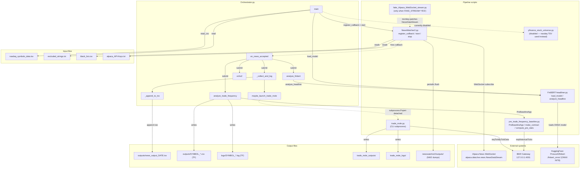
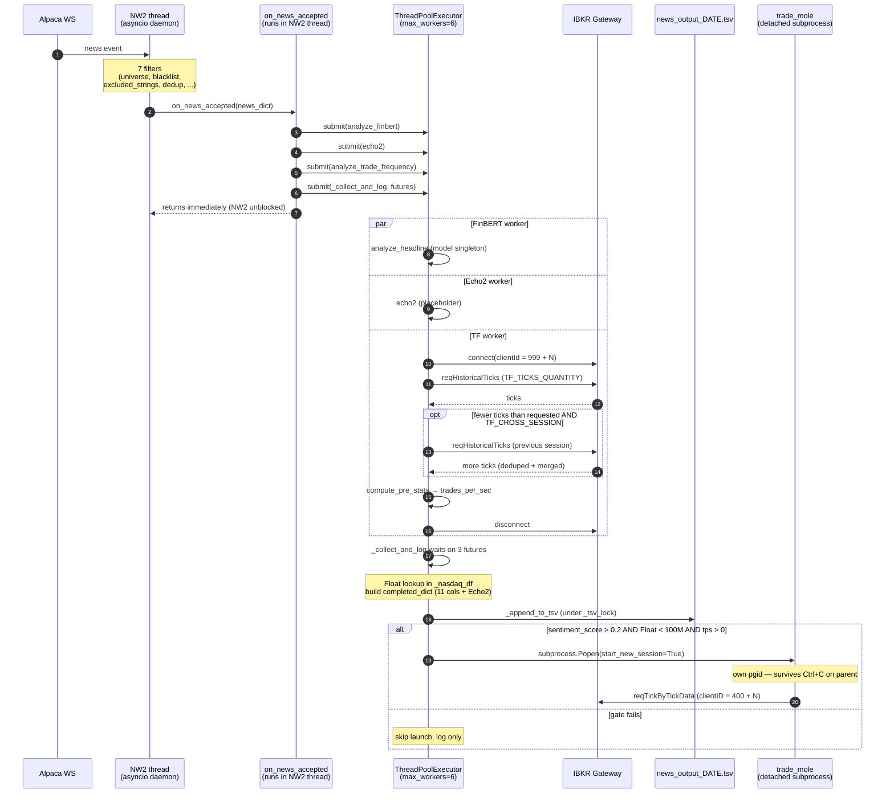
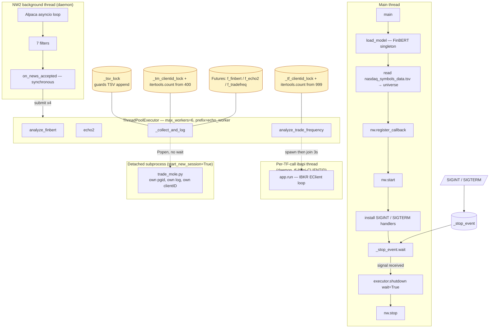
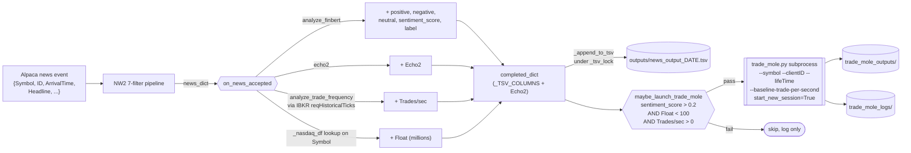

# Orchestrator Architecture

Visual reference for `Orchestrator.py`. Four Mermaid diagrams, each answering a different question:

1. **Component / module map** — what scripts and external systems are involved, and what calls/reads/writes what.
2. **Per-news sequence** — exactly what happens on the wire and on the threads when one news item arrives.
3. **Threading / concurrency** — which threads and processes exist, and how they synchronize.
4. **Data-flow pipeline** — how a news_dict gets enriched into the TSV row that drives the trade-mole trigger.

For prose-level documentation see [`CLAUDE.md`](./CLAUDE.md). The diagrams below are not duplicated as text — read the source if you need deeper detail.

---

## 1. Component / Module Map

---

## 2. Per-News Sequence

---

## 3. Threading / Concurrency

---

## 4. Data-Flow Pipeline

